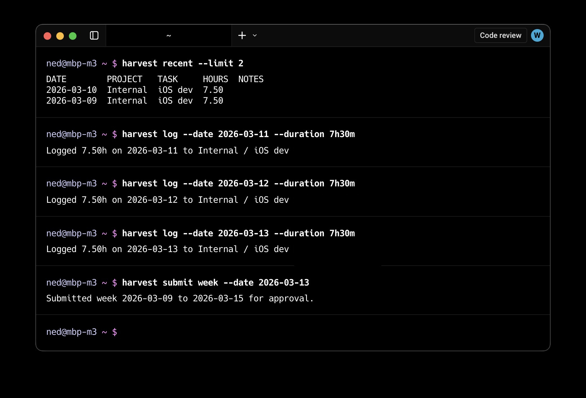

# harvest

`harvest` is a small CLI for logging time to Harvest and submitting a week for approval.



The repo also includes an installable agent skill in [`skills/harvest`](skills/harvest/SKILL.md).

## Install

```bash
brew tap n3d1117/harvest-cli https://github.com/n3d1117/harvest-cli
brew install n3d1117/harvest-cli/harvest
```

```bash
npx skills add n3d1117/harvest-cli --skill harvest
```

## Use the skill

After installing the skill, how you invoke the skill depends on the host tool:

- Claude Code: `/harvest`
- Codex: `$harvest`
- Natural language: `Use the harvest skill to log 1h on Acme / Development today`

## Setup

Get your Harvest account ID and token:

1. Go to `https://id.getharvest.com/developers`
2. Click `Create new personal access token`
3. Give it a name
4. Copy the account ID and the token

Interactive setup:

```bash
harvest login
```

Non-interactive setup:

```bash
harvest config set \
  --account-id 123456 \
  --token YOUR_TOKEN \
  --default-project "Acme" \
  --default-task "Development"
```

Check auth:

```bash
harvest whoami
```

Config file:

```text
~/Library/Application Support/harvest/config.json
```

Environment overrides:

- `HARVEST_ACCOUNT_ID`
- `HARVEST_TOKEN`
- `HARVEST_DEFAULT_PROJECT`
- `HARVEST_DEFAULT_TASK`

Precedence:

1. command flags
2. environment variables
3. config file

## Submit Auth

Public API commands use your Harvest account ID and personal access token.
`harvest submit` uses Harvest website auth because Harvest has no public submit-for-approval API.

Create submit auth:

```bash
harvest submit auth login --email you@example.com --save-password
```

Check submit auth:

```bash
harvest submit auth status
```

Saved submit passwords and website session cookies live in macOS Keychain.

Observed Harvest website cookie lifetimes from a live login on 2026-03-11:

- `_harvest_sess`: about 15 days
- `production_access_token`: about 60 days

## Daily Use

List active project/task pairs:

```bash
harvest projects
```

Reuse a recent pair:

```bash
harvest recent
```

Log time:

```bash
harvest log \
  --project "Acme" \
  --task "Development" \
  --duration 1h30m \
  --date today \
  --notes "CLI scaffolding"

harvest log \
  --project "Acme" \
  --task "Development" \
  --duration 1h30m \
  --date today \
  --dry-run
```

Review today:

```bash
harvest today
```

Submit the week that contains a date:

```bash
harvest submit week --date today
```

## Dry Run

Use `--dry-run` to validate and preview a write without changing Harvest state.

Preview a time entry:

```bash
harvest log \
  --project "Acme" \
  --task "Development" \
  --duration 1h30m \
  --date today \
  --dry-run
```

Preview a weekly submit:

```bash
harvest submit week --date today --dry-run
```

## JSON

These commands support `--json`:

```bash
harvest config show --json
harvest projects --json
harvest recent --json
harvest log --project "Acme" --task "Development" --duration 1h --dry-run --json
harvest log --project "Acme" --task "Development" --duration 1h --json
harvest today --json
harvest submit auth status --json
harvest submit week --date 2026-03-09 --dry-run --json
harvest submit week --date 2026-03-09 --json
```

## Docs

- [`skills/harvest/SKILL.md`](skills/harvest/SKILL.md)
- [`skills/harvest/references/commands.md`](skills/harvest/references/commands.md)
- [`skills/harvest/references/setup-and-config.md`](skills/harvest/references/setup-and-config.md)
- [`skills/harvest/references/daily-commands.md`](skills/harvest/references/daily-commands.md)
- [`skills/harvest/references/root-help-and-errors.md`](skills/harvest/references/root-help-and-errors.md)

## Development

```bash
cd cli
go test ./...
go run ./cmd/harvest help
```
